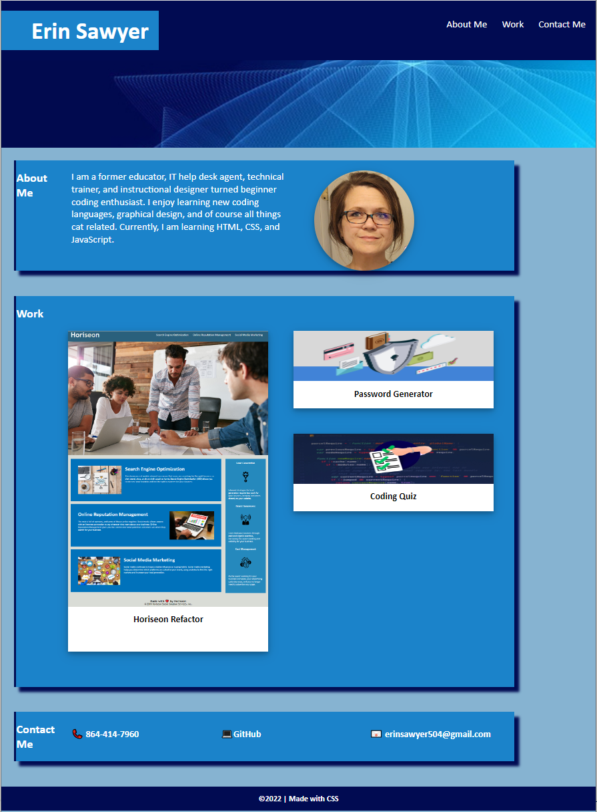

## Erin Sawyer Portfolio - README

I started with a blank html and css file and built the portolio from the ground up.  Several areas I was really interested in implementing was the CSS variables, pseudo classes, and the responsive website capabilities.  I tried to do a flexbox build at first but was having issues with the over all layout I had in mind.  I ended up learning more about grid layouts and applied a little bit of a media query to really fine tune the responsiveness.  It isn't perfect but a work in progress. 

## Links
Git Hub Repository: https://github.com/erinsawyer504/erin-sawyer-portfolio

Deployed Website: https://erinsawyer504.github.io/erin-sawyer-portfolio/

## User Story

```
AS AN employer
I WANT to view a potential employee's deployed portfolio of work samples
SO THAT I can review samples of their work and assess whether they're a good candidate for an open position
```

## Acceptance Criteria

```
GIVEN I need to sample a potential employee's previous work
WHEN I load their portfolio
THEN I am presented with the developer's name, a recent photo or avatar, and links to sections about them, their work, and how to contact them
WHEN I click one of the links in the navigation
THEN the UI scrolls to the corresponding section
WHEN I click on the link to the section about their work
THEN the UI scrolls to a section with titled images of the developer's applications
WHEN I am presented with the developer's first application
THEN that application's image should be larger in size than the others
WHEN I click on the images of the applications
THEN I am taken to that deployed application
WHEN I resize the page or view the site on various screens and devices
THEN I am presented with a responsive layout that adapts to my viewport
```

## Website Preview





---
© 2022 edX Boot Camps LLC. Confidential and Proprietary. All Rights Reserved.
